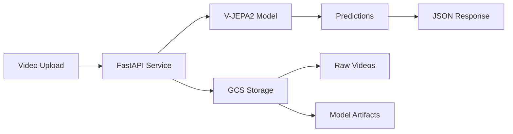

# V-JEPA2 Video Classifier on Google Cloud Run

Deploy a V-JEPA2 video classification model on Google Cloud Run with GPU support (L4) for scalable video analysis.

## 🎯 Overview

This project provides a complete deployment solution for the V-JEPA2 (Video Joint Embedding Predictive Architecture 2) model on Google Cloud Platform. It includes:

- **FastAPI service** with video classification endpoints
- **Local testing** capabilities (CPU/GPU support)
- **GCS integration** for video storage
- **Cloud Run deployment** with L4 GPU
- **Docker containerization** for consistent environments
- **Comprehensive testing** suite

## 🏗️ Architecture



## 🚀 Quick Start

### 1. Local Testing (Recommended First)

```bash
# Clone and navigate to the project
cd cloud-run

# Start local development server
./scripts/run_local.sh

# In another terminal, run tests
python3 tests/test_local.py
```

### 2. Docker Testing

```bash
# Build and run with Docker Compose
docker-compose up --build

# Test the containerized service
python3 tests/test_local.py
```

### 3. Cloud Deployment

```bash
# Set up GCS buckets
./scripts/setup_bucket.sh

# Deploy to Cloud Run
./scripts/deploy.sh
```

## 📋 Prerequisites

### Local Development
- Python 3.10+
- PyTorch with CUDA support (optional, will fallback to CPU)
- FFmpeg
- 8GB+ RAM (16GB+ recommended for GPU)

### Cloud Deployment
- Google Cloud SDK (`gcloud`)
- Authenticated GCP account
- Project with billing enabled
- Required APIs enabled (done automatically by deploy script)

## 🔧 Configuration

### Environment Variables

| Variable | Default | Description |
|----------|---------|-------------|
| `USE_GCS` | `false` | Enable GCS storage integration |
| `ENVIRONMENT` | `production` | Environment mode |
| `PORT` | `8080` | Server port |

### Cloud Run Configuration

- **CPU**: 8 vCPUs
- **Memory**: 32 GiB
- **GPU**: 1x NVIDIA L4
- **Scaling**: 0-4 instances
- **Timeout**: 60 minutes
- **Concurrency**: 1 request per instance

## 📡 API Endpoints

### Health Check
```bash
GET /health
```

### Video Classification (File Upload)
```bash
POST /classify-upload
Content-Type: multipart/form-data

curl -X POST "http://localhost:8080/classify-upload" \
  -F "file=@video.mp4" \
  -F "frames_per_clip=16"
```

### Video Classification (URI)
```bash
POST /classify
Content-Type: application/json

{
  "video_uri": "gs://bucket/video.mp4",
  "frames_per_clip": 16
}
```

### System Information
```bash
GET /info
```

## 📊 Response Format

```json
{
  "predictions": [[0.1, 0.8, 0.1, ...]],
  "top_class": "dancing",
  "top_k_classes": [
    {"class": "dancing", "confidence": 0.8, "class_id": 45},
    {"class": "jumping", "confidence": 0.15, "class_id": 23},
    {"class": "walking", "confidence": 0.05, "class_id": 67}
  ],
  "frames_processed": 16,
  "device_used": "cuda",
  "video_duration": 5.2,
  "processing_time": 2.3
}
```

## 🧪 Testing

### Local Testing Suite
```bash
# Run comprehensive local tests
python3 tests/test_local.py

# Test specific endpoints
curl http://localhost:8080/health
```

### Cloud Testing
```bash
# Test deployed service (requires authentication)
python3 test_deployed.py
```

## 📁 Project Structure

```
cloud-run/
├── service/                 # Main application
│   ├── main.py             # FastAPI application
│   ├── model_handler.py    # V-JEPA2 model wrapper
│   ├── gcs_utils.py        # GCS operations
│   ├── requirements.txt    # Python dependencies
│   └── Dockerfile          # Container definition
├── scripts/                 # Deployment scripts
│   ├── run_local.sh        # Local development
│   ├── setup_bucket.sh     # GCS setup
│   └── deploy.sh           # Cloud deployment
├── tests/                   # Test files
│   └── test_local.py       # Testing suite
├── deploy/                  # Deployment configs
│   ├── cloudbuild.yaml     # Cloud Build config
│   └── nginx.conf          # Nginx proxy config
└── docker-compose.yml      # Local Docker setup
```

## 🔍 Monitoring & Debugging

### View Logs
```bash
# Cloud Run logs
gcloud logging read \
  'resource.type=cloud_run_revision AND resource.labels.service_name=vjepa2-classifier' \
  --limit=50

# Local logs
# Logs are displayed in the terminal when running locally
```

### Resource Monitoring
```bash
# Service details
gcloud run services describe vjepa2-classifier --region=us-central1

# Check GPU availability
docker run --gpus all nvidia/cuda:11.8-runtime-ubuntu22.04 nvidia-smi
```

## 💰 Cost Optimization

- **Scale to Zero**: Min instances = 0
- **GPU Efficiency**: L4 for fast inference
- **Concurrent Requests**: Limit = 1 per instance for optimal GPU utilization
- **Request Timeouts**: 60 minutes maximum
- **Storage**: Use GCS lifecycle policies for old videos

## 🔒 Security

- Service runs as non-root user
- Private by default (no public access)
- Service account with minimal permissions
- HTTPS only in production
- Rate limiting via nginx (optional)

## 🚨 Troubleshooting

### Common Issues

1. **Model Loading Errors**
   ```bash
   # Check available memory
   free -h

   # Verify PyTorch installation
   python3 -c "import torch; print(torch.__version__)"
   ```

2. **GPU Not Detected**
   ```bash
   # Verify CUDA installation
   nvidia-smi

   # Check PyTorch CUDA support
   python3 -c "import torch; print(torch.cuda.is_available())"
   ```

3. **GCS Permission Errors**
   ```bash
   # Verify authentication
   gcloud auth list

   # Test bucket access
   gsutil ls gs://vjepa2/
   ```

4. **Cloud Run Timeout**
   - Increase timeout: `--timeout 3600`
   - Reduce frames_per_clip for faster processing
   - Check instance memory usage

### Getting Help

1. Check service logs for detailed error messages
2. Verify all prerequisites are installed
3. Test locally before deploying to Cloud Run
4. Ensure GCS buckets are properly configured

## 🤝 Contributing

1. Test changes locally first
2. Update tests for new features
3. Follow the existing code style
4. Update documentation as needed

## 📝 License

This project uses the V-JEPA2 model from Facebook Research. Please check the model's license terms for usage restrictions.