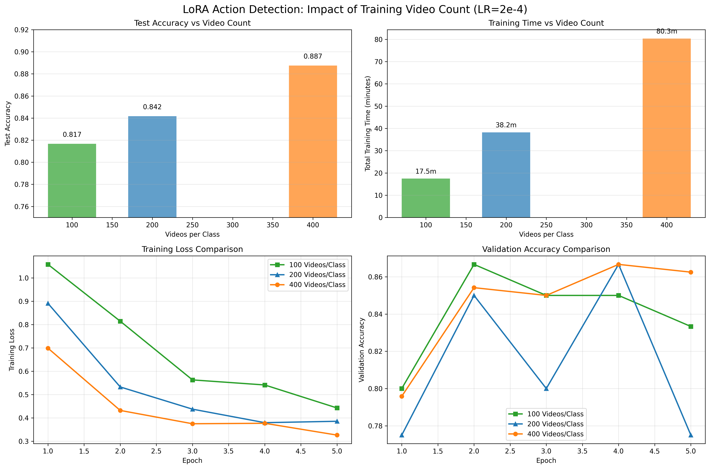
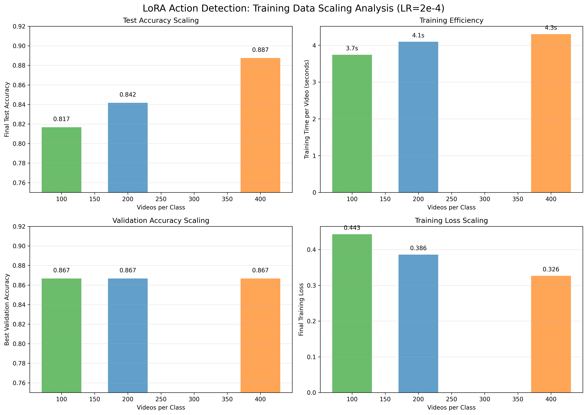

# V-JEPA 2 Fine-tuning Training Guide

This guide provides an in-depth explanation of the fine-tuning approaches implemented in this repository, the model architecture, and detailed descriptions of all training scripts.

## Table of Contents

- [Architecture Overview](#architecture-overview)
- [Understanding Tokens and Attention](#understanding-tokens-and-attention)
- [Training Approaches](#training-approaches)
- [Training Scripts](#training-scripts)
- [Configuration](#configuration)
- [Experimental Results](#experimental-results)
- [Recommendations](#recommendations)

---

## Architecture Overview

### Model Components

The V-JEPA 2 video classification model consists of three main components:

```
┌─────────────────────────────────────────────────────┐
│  Input Video                                        │
│  [batch, frames, height, width, channels]           │
└─────────────────┬───────────────────────────────────┘
                  │
                  ▼
┌─────────────────────────────────────────────────────┐
│  1. V-JEPA2 Backbone (vjepa2)                      │
│     - Vision Transformer encoder                    │
│     - Processes video into spatiotemporal patches   │
│     - 375M parameters (frozen in most approaches)   │
│     Output: [batch, num_tokens, hidden_dim]         │
└─────────────────┬───────────────────────────────────┘
                  │
                  ▼
┌─────────────────────────────────────────────────────┐
│  2. Pooler                                          │
│     - Cross-attention layer                         │
│       • Aggregates frame embeddings into learned    │
│         pooler tokens                               │
│     - 3 Self-attention layers                       │
│       • Pooler tokens refine themselves             │
│     - 49M parameters                                │
│     Output: [batch, num_pooler_tokens, hidden_dim]  │
└─────────────────┬───────────────────────────────────┘
                  │
                  ▼
┌─────────────────────────────────────────────────────┐
│  3. Classifier Head                                 │
│     - Linear layer(s) for classification            │
│     - 4K parameters                                 │
│     Output: [batch, num_classes]                    │
└─────────────────────────────────────────────────────┘
```

### Total Model Parameters

- **Total**: ~375M parameters
- **Backbone (vjepa2)**: ~326M parameters
- **Pooler**: ~49M parameters
- **Classifier head**: ~4K parameters

---

## Understanding Tokens and Attention

### What is a Token?

A **token** is an embedding vector - a learned representation containing features. In this architecture:

#### 1. Frame Tokens (from backbone)
- **What**: Embedding vectors representing spatiotemporal features from the video
- **Created by**: The vjepa2 backbone processing video frames
- **Shape**: `[batch, num_frame_tokens, hidden_dim]`
- **Represent**: Spatial-temporal patches or features from the input video

**Why multiple tokens instead of one?**
- **Preserves spatial structure**: Different regions of each frame maintain separate representations
- **Preserves temporal structure**: Different time steps maintain separate representations
- **Enables task-specific aggregation**: The pooler can learn which parts to focus on

Example: A video with 16 frames, where each frame is divided into 14×14 patches, would produce embeddings for different spatiotemporal locations.

#### 2. Pooler Tokens (learned parameters)
- **What**: Trainable embedding vectors initialized as model parameters
- **Created by**: Model initialization (not derived from input)
- **Shape**: `[batch, num_pooler_tokens, hidden_dim]`
- **Purpose**: Aggregate and process information from frame tokens

### Attention Mechanisms in the Pooler

#### Cross-Attention Layer
```python
# In: pooler.cross_attention_layer.cross_attn
Query:     Pooler tokens (learned parameters)
Key:       Frame tokens from backbone
Value:     Frame tokens from backbone

# Operation: Pooler tokens attend to frame tokens
# Result: Pooler tokens now contain aggregated video information
```

**Purpose**: Selectively aggregate information from all video frames into the pooler tokens. The pooler learns "which spatial-temporal regions matter for this task?"

#### Self-Attention Layers (3 layers)
```python
# In: pooler.self_attention_layers[0, 1, 2].self_attn
Query:     Pooler tokens
Key:       Pooler tokens (same tokens!)
Value:     Pooler tokens (same tokens!)

# Operation: Pooler tokens attend to each other
# Result: Refined pooler representations
```

**Purpose**: Allow the aggregated representations to interact and refine themselves before classification.

### Attention Module Structure

Each attention layer contains these projection matrices:
- **q_proj**: Projects inputs to queries
- **k_proj**: Projects inputs to keys
- **v_proj**: Projects inputs to values
- **out_proj**: Projects attention output (in self-attention layers)

These are the modules targeted by LoRA adapters in our training approaches.

---

## Training Approaches

We implement four fine-tuning approaches with different trade-offs between parameter efficiency and performance:

### 1. Head-Only Fine-tuning
**Script**: `src/action_detection/head_tuning.py`

**Trainable components**:
- ✅ Classifier head (~4K parameters)
- ❌ Pooler (frozen)
- ❌ Backbone (frozen)

**Characteristics**:
- Most parameter-efficient (0.001% of parameters)
- Fastest training
- Limited adaptation capacity - can only learn new decision boundaries
- Best for: Minimal parameter budgets, quick experiments

### 2. Pooler+Head Fine-tuning
**Script**: `src/action_detection/pooler_and_head_fine_tuning.py`

**Trainable components**:
- ✅ Classifier head (~4K parameters)
- ✅ Pooler (~49M parameters)
- ❌ Backbone (frozen)

**Characteristics**:
- 13.15% of parameters trainable
- Adapts both aggregation (pooler) and classification
- Best accuracy with sufficient data
- Best for: Maximum accuracy when data is abundant

### 3. LoRA Fine-tuning
**Scripts**:
- `src/action_detection/lora_fine_tuning.py`
- `src/vid_classification/lora_fine_tuning.py`

**Trainable components**:
- ✅ Classifier head (~4K parameters)
- ✅ LoRA adapters in pooler attention (~491K parameters)
- ❌ Original pooler weights (frozen)
- ❌ Backbone (frozen)

**LoRA configuration**:
```python
rank: 16           # Rank of low-rank decomposition
alpha: 32.0        # Scaling factor (alpha/rank = 2.0)
dropout: 0.1       # Dropout rate for LoRA layers
target_modules: ["q_proj", "v_proj", "k_proj", "out_proj"]
```

**Where LoRA is applied** (15 modules in pooler):
- `pooler.cross_attention_layer.cross_attn.{q,k,v}_proj` (3 modules)
- `pooler.self_attention_layers.0.self_attn.{q,k,v,out}_proj` (4 modules)
- `pooler.self_attention_layers.1.self_attn.{q,k,v,out}_proj` (4 modules)
- `pooler.self_attention_layers.2.self_attn.{q,k,v,out}_proj` (4 modules)

**How LoRA works**:
- Original weights W₀ are frozen
- Adds low-rank adaptation: W = W₀ + (B × A) × (α/r)
- Where A ∈ ℝ^(d×r), B ∈ ℝ^(r×d), r << d
- Only A and B are trained (much fewer parameters)

**Characteristics**:
- 0.13% of parameters trainable (100x fewer than pooler+head)
- Excellent parameter efficiency vs performance trade-off
- Adapts how the pooler aggregates and processes information
- Best for: Parameter-efficient fine-tuning with good performance

### 4. Pooler+Head+LoRA Fine-tuning
**Script**: `src/action_detection/pooler_head_and_lora_fine_tuning.py`

**Trainable components**:
- ✅ Classifier head (~4K parameters)
- ✅ Pooler weights (~49M parameters)
- ✅ LoRA adapters in pooler attention (~491K parameters)
- ❌ Backbone (frozen)

**Characteristics**:
- 13.26% of parameters trainable
- Combines full pooler training with LoRA adapters
- In experiments, did NOT improve over pooler+head alone
- May introduce optimization challenges
- Best for: Experimental - not recommended based on results

---

## Training Scripts

### Action Detection Scripts

Location: `src/action_detection/`

All action detection scripts:
- Use the NTU RGB+D dataset
- Train on 4 action classes: sitting_down, standing_up, waving, other
- Share common hyperparameters via `config.py`
- Use consistent data splits (70/15/15 train/val/test)
- Apply same augmentations and evaluation metrics

#### `config.py`
Shared training configuration:

```python
@dataclass
class TrainingConfig:
    # Training hyperparameters
    num_epochs: int = 5
    batch_size: int = 1
    accumulation_steps: int = 4
    learning_rate: float = 2e-4  # Set for parameter-efficient training
    weight_decay: float = 0.01

    # Data configuration
    num_workers: int = 0

    # Model configuration
    model_name: str = "facebook/vjepa2-vitl-fpc16-256-ssv2"

    # LoRA configuration (only used for LoRA approaches)
    lora_rank: int = 16
    lora_alpha: float = 32.0
    lora_dropout: float = 0.1

    # Random seed
    seed: int = 42
```

#### `head_tuning.py`
Trains only the classifier head.

**Key implementation**:
```python
# Freeze backbone and pooler
for param in model.vjepa2.parameters():
    param.requires_grad = False

for param in model.pooler.parameters():
    param.requires_grad = False

# Only classifier head is trainable
trainable = [p for p in model.parameters() if p.requires_grad]
optimizer = torch.optim.AdamW(trainable, lr=config.learning_rate,
                               weight_decay=config.weight_decay)
```

**Usage**:
```bash
python src/action_detection/head_tuning.py --num_videos 200
```

#### `pooler_and_head_fine_tuning.py`
Trains the pooler and classifier head.

**Key implementation**:
```python
# Freeze backbone only
for param in model.vjepa2.parameters():
    param.requires_grad = False

# Pooler and classifier head are trainable
trainable = [p for p in model.parameters() if p.requires_grad]
optimizer = torch.optim.AdamW(trainable, lr=config.learning_rate,
                               weight_decay=config.weight_decay)
```

**Usage**:
```bash
python src/action_detection/pooler_and_head_fine_tuning.py --num_videos 200
```

#### `lora_fine_tuning.py`
Applies LoRA adapters to pooler attention modules.

**Key implementation**:
```python
# Freeze all parameters first
for param in model.parameters():
    param.requires_grad = False

# Apply LoRA to attention modules
adapted_count = apply_lora_to_model(
    model,
    target_modules=["q_proj", "v_proj", "k_proj", "out_proj"],
    rank=config.lora_rank,
    alpha=config.lora_alpha,
    dropout=config.lora_dropout,
)

# Unfreeze the classification head
for param in model.classifier.parameters():
    param.requires_grad = True

# LoRA parameters and classifier are trainable
trainable_params = [p for p in model.parameters() if p.requires_grad]
optimizer = torch.optim.AdamW(trainable_params, lr=config.learning_rate,
                               weight_decay=config.weight_decay)
```

**Usage**:
```bash
python src/action_detection/lora_fine_tuning.py --num_videos 200
```

#### `pooler_head_and_lora_fine_tuning.py`
Combines pooler+head training with LoRA adapters.

**Key implementation**:
```python
# Freeze backbone first
for param in model.vjepa2.parameters():
    param.requires_grad = False

# Apply LoRA to attention modules (original weights frozen)
adapted_count = apply_lora_to_model(
    model,
    target_modules=["q_proj", "v_proj", "k_proj", "out_proj"],
    rank=config.lora_rank,
    alpha=config.lora_alpha,
    dropout=config.lora_dropout,
)

# Keep pooler and classifier head trainable
for param in model.pooler.parameters():
    param.requires_grad = True

for param in model.classifier.parameters():
    param.requires_grad = True

# Pooler, LoRA, and classifier are trainable
trainable_params = [p for p in model.parameters() if p.requires_grad]
optimizer = torch.optim.AdamW(trainable_params, lr=config.learning_rate,
                               weight_decay=config.weight_decay)
```

**Usage**:
```bash
python src/action_detection/pooler_head_and_lora_fine_tuning.py --num_videos 200
```

### Video Classification Scripts

Location: `src/vid_classification/`

Scripts for UCF-101 video classification (101 action classes).

#### `lora_fine_tuning.py`
LoRA fine-tuning for UCF-101 dataset.

**Differences from action detection version**:
- Uses UCF-101 dataset (101 classes)
- Uses common data loading utilities from `src.common.data`
- Hardcoded hyperparameters instead of config file
- Same LoRA approach and target modules

**Usage**:
```bash
python src/vid_classification/lora_fine_tuning.py --num_train_videos 5000 --frames_per_clip 16
```

---

## Configuration

### Shared Configuration (`src/action_detection/config.py`)

All action detection scripts use `DEFAULT_CONFIG` from `config.py`. This ensures fair comparison across approaches.

**Key hyperparameters**:
- **Learning rate**: `2e-4` - Lower than typical full fine-tuning (1e-3) due to parameter-efficient training
- **Weight decay**: `0.01` - Regularization applied equally to all approaches
- **Batch size**: `1` with gradient accumulation steps of `4` (effective batch size = 4)
- **Epochs**: `5`

**Important note on optimizer consistency**:
All approaches must use the same optimizer (`AdamW`) with the same `weight_decay`. Earlier experiments revealed that using different optimizers (Adam vs AdamW) or different weight decay values created unfair comparisons and artificially handicapped LoRA performance.

### Data Augmentation

**Training augmentations**:
```python
train_transforms = v2.Compose([
    v2.RandomResizedCrop((crop_height, crop_width)),
    v2.RandomHorizontalFlip(),
])
```

**Evaluation augmentations**:
```python
eval_transforms = v2.Compose([
    v2.CenterCrop((crop_height, crop_width))
])
```

### Dataset Splits

**Action detection** (NTU RGB+D):
- Train: 70% of videos
- Validation: 15% of videos
- Test: 15% of videos
- Random seed: 42 (for reproducibility)

---

## Experimental Results

### Action Detection (200 videos per class, LR=2e-4)

| Approach | Test Acc | Val Acc | Trainable Params | % of Total | Training Time |
|----------|----------|---------|------------------|------------|---------------|
| **Pooler+Head** | **88.33%** | 88.33% | 49,340,420 | 13.15% | 38.5 min |
| **LoRA** | **84.17%** | 86.67% | 495,620 | 0.13% | 38.2 min |
| **Pooler+Head+LoRA** | **82.50%** | 83.33% | 49,831,940 | 13.26% | 38.8 min |
| **Head-only** | **78.33%** | 80.00% | 4,100 | 0.001% | 34.1 min |

### Key Findings

1. **Pooler+Head performs best with sufficient data**
   - 88.33% test accuracy
   - Requires 49M trainable parameters (13.15%)
   - Best when data is abundant (200+ videos per class)

2. **LoRA achieves excellent parameter efficiency**
   - 84.17% test accuracy (only 4.16% lower than pooler+head)
   - Uses 100x fewer parameters than pooler+head (0.13% vs 13.15%)
   - Optimal trade-off between efficiency and performance

3. **Head-only is most efficient but least accurate**
   - 78.33% test accuracy
   - Only 4,100 parameters (0.001%)
   - Limited by frozen pooler - can only learn decision boundaries

4. **Pooler+Head+LoRA did not improve over Pooler+Head**
   - 82.50% test accuracy (5.83% lower than pooler+head alone)
   - Adding LoRA to full pooler training may introduce optimization challenges
   - Not recommended based on experimental results

### LoRA Scaling Analysis

The following plots show how LoRA performance scales with training data size (100, 200, and 400 videos per class):



**Training Curve Analysis**:
- Test accuracy improves significantly with more training data: 81.67% → 84.17% → 88.75%
- Training time scales linearly: 17.5 min → 38.2 min → 80.3 min
- Training loss decreases consistently: 0.4427 → 0.3857 → 0.3264
- Validation accuracy plateaus at 86.67% across all configurations



**Scaling Insights**:
- Test accuracy shows strong positive scaling with training data
- Improvement rates: +3.1% (100→200 videos), +5.4% (200→400 videos)
- Training time per video remains consistent (~3.7-4.3 seconds)
- Best validation accuracy plateaus at 86.67%, but test accuracy continues improving
- Final training loss continues to decrease, suggesting benefit from even more training data
- **Recommendation**: Use 400 videos/class for production (88.8% accuracy), or 200 videos/class if training time is critical (84.2% accuracy)

### Scaling Behavior

Performance trends across different dataset sizes:

| Dataset Size | Head-only | LoRA | Pooler+Head |
|--------------|-----------|------|-------------|
| 50 videos | 76.67% | 76.67% | 13.33% |
| 100 videos | 83.33% | 81.67% | 76.67% |
| 200 videos | 78.33% | 84.17% | 88.33% |
| 400 videos | — | **88.75%** | — |

**Observations**:
- Pooler+head struggles with small datasets (overfitting)
- LoRA maintains consistent performance across dataset sizes
- Head-only performance plateaus early

---

## Recommendations

### Choose based on your constraints:

#### **For Maximum Accuracy**
→ Use **Pooler+Head** (`pooler_and_head_fine_tuning.py`)
- Best when: Dataset has 100+ examples per class
- Achieves: Highest accuracy (88.33% in experiments)
- Trade-off: 13% of parameters, longer training

#### **For Parameter Efficiency**
→ Use **LoRA** (`lora_fine_tuning.py`)
- Best when: Limited compute, need parameter efficiency
- Achieves: Competitive accuracy (84.17%) with 100x fewer parameters
- Trade-off: Slightly lower accuracy than pooler+head

#### **For Minimal Parameter Budget**
→ Use **Head-only** (`head_tuning.py`)
- Best when: Extreme parameter constraints, quick experiments
- Achieves: Reasonable accuracy (78.33%) with minimal parameters
- Trade-off: Limited adaptation capacity

#### **Not Recommended**
→ **Pooler+Head+LoRA** showed no benefit over pooler+head alone

### General Guidelines

1. **Learning rate**: Use `2e-4` for parameter-efficient approaches
2. **Optimizer**: Always use `AdamW` with `weight_decay=0.01` for fair comparison
3. **Data**: More data benefits pooler+head more than LoRA or head-only
4. **Monitoring**: Track validation accuracy to prevent overfitting (especially with pooler+head on small datasets)

---

## Common Issues and Solutions

### Issue: LoRA performs worse than expected

**Cause**: Inconsistent optimizer configuration (different weight decay or optimizer type)

**Solution**: Ensure all approaches use `AdamW` with the same `weight_decay`. This was a critical bug discovered during experiments.

### Issue: Pooler+Head overfits on small datasets

**Symptom**: High validation accuracy but low test accuracy, or validation accuracy decreasing after early epochs

**Solution**:
- Use LoRA instead for small datasets
- Reduce learning rate
- Increase weight decay
- Use fewer epochs

### Issue: Out of memory errors

**Solution**:
- Reduce `batch_size` (currently 1)
- Reduce `frames_per_clip`
- Use gradient checkpointing (not currently implemented)
- For LoRA: Memory should not be an issue due to few trainable parameters

### Issue: Training is too slow

**Solution**:
- Reduce `num_workers` if I/O bound (currently 0)
- Use head-only approach for quick experiments
- Profile to identify bottlenecks (data loading vs computation)

---

## Experiment Tracking

All experiments are automatically logged to `experiments.csv` with the following information:

- Timestamp
- Approach (head_only, pooler_and_head, lora, pooler_head_and_lora)
- Dataset size (train/val/test videos)
- Hyperparameters (learning rate, batch size, etc.)
- Trainable vs total parameters
- Final test accuracy
- Best validation accuracy
- Training time

Individual experiment metrics are also saved as JSON files:
- `head_only_metrics_*.json`
- `pooler_head_metrics_*.json`
- `lora_action_metrics_*.json`
- `pooler_head_lora_metrics_*.json`

TensorBoard logs are saved to `runs/` directory for detailed training visualization.

---

## Future Improvements

Potential enhancements to explore:

1. **Apply LoRA to backbone**: Currently LoRA only targets pooler attention modules. Applying LoRA to backbone attention could improve performance.

2. **Dynamic learning rates**: Use learning rate schedules or warmup for better convergence.

3. **Gradient checkpointing**: Reduce memory usage to enable larger batch sizes.

4. **Mixed precision training**: Use FP16 for faster training (requires careful tuning).

5. **Data augmentation**: Explore additional augmentations (temporal jittering, color augmentation, etc.)

6. **Hyperparameter search**: Systematic search for optimal LoRA rank, alpha, and dropout values.

---

## References

- [LoRA: Low-Rank Adaptation of Large Language Models](https://arxiv.org/abs/2106.09685)
- [V-JEPA 2 Model Documentation](https://huggingface.co/facebook/vjepa2-vitl-fpc16-256-ssv2)
- [NTU RGB+D Dataset](https://arxiv.org/abs/1604.02808)
- [UCF-101 Dataset](https://www.crcv.ucf.edu/data/UCF101.php)
