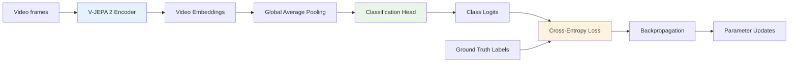
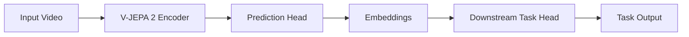
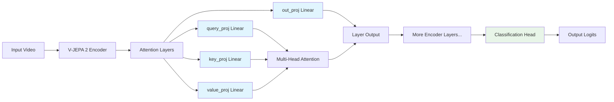
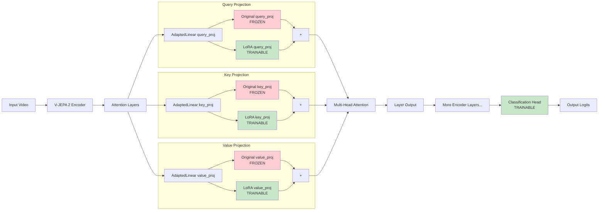
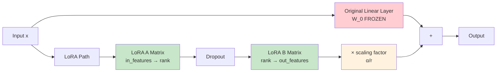
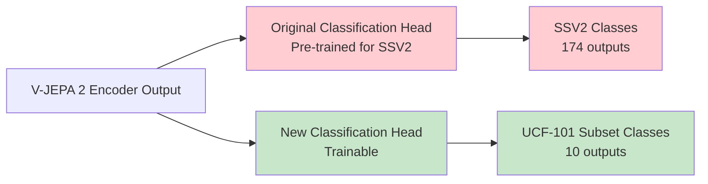

# V-JEPA 2 LoRA Fine-tuning Architecture

This document shows the architecture changes for V-JEPA 2 LoRA fine-tuning on a **UCF-101 subset with 10 classes** (not the full 101 classes).

## V-JEPA 2 General Training for Classification


## V-JEPA 2 Inference


## V-JEPA 2 With Classification Output (Without LoRA)


## V-JEPA 2 Model with LoRA Adapters


## LoRA Layer Internal Structure


### LoRA Mathematical Formulation

The LoRA adaptation follows this equation:
```
h = W₀x + ΔWx = W₀x + BAx × (α/r)
```

Where:
- `W₀` = Original pre-trained weight matrix (frozen)
- `ΔW = BA` = Low-rank decomposition of weight update
- `B` = LoRA B matrix (rank → out_features)
- `A` = LoRA A matrix (in_features → rank)
- `α` = LoRA alpha parameter (32.0)
- `r` = LoRA rank (16)
- `α/r` = scaling factor (2.0)

### Matrix Dimensions Example
For a typical attention projection layer in V-JEPA 2:
```
Input x:           [batch_size, seq_len, 1024]
W₀ (frozen):       [1024, 1024]
A matrix:          [1024, 16]     # in_features → rank
B matrix:          [16, 1024]     # rank → out_features
BA decomposition:  [1024, 1024]   # same as W₀
```

## Classification Head Replacement (Without LoRA)


## Key Changes Summary
- **216 LoRA modules** applied to attention layers (query_proj, key_proj, value_proj, out_proj)
- **Original attention weights frozen** (red boxes)
- **LoRA adapters trainable** (green boxes) with rank=16, α=32.0
- **Classification head replaced** and trainable for UCF-101 subset (10 classes vs original SSV2 174 classes)
- **Massive parameter reduction**: Only LoRA + classification head parameters are trainable
- **Classification head parameters**: ~10,240 parameters (1024 hidden × 10 classes + 10 bias terms)
- **LoRA parameters**: ~501,760 parameters across all attention modules
- **Total trainable**: ~512,000 parameters vs 375M+ total model parameters
